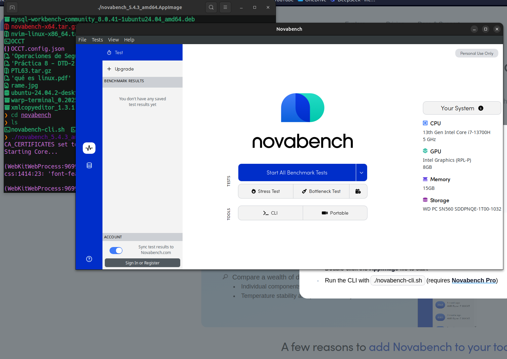

# Guía Completa para Novabench

## **Introducción**
Novabench es una herramienta de benchmarking gratuita que ofrece pruebas rápidas y completas para evaluar el rendimiento de tu CPU, GPU, RAM y almacenamiento. Es ideal para comparar tu sistema con otros y detectar posibles problemas de hardware.

---

## **Descarga e Instalación**

### **1. Descarga**
- Visita la página oficial de Novabench en [https://novabench.com](https://novabench.com).
- Descarga la versión adecuada para tu sistema operativo (Windows, macOS o Linux).

### **2. Instalación**
- Abre el archivo descargado y sigue los pasos del asistente de instalación:
  - Acepta los términos y condiciones.
  - Selecciona la ubicación de instalación.
  - Haz clic en "Instalar".
- Una vez completada la instalación, abre el programa.

---

## **Tipos de Pruebas y Uso Básico**

### **1. Prueba de CPU**
- **Uso**: Mide el rendimiento de la CPU en tareas de cálculo intensivo.
- **Cómo ejecutarla**:
  - Abre Novabench y selecciona la prueba de `CPU`.
  - Haz clic en `Start Benchmark`.
- **Qué observar**:
  - Obtendrás un puntaje que refleja la capacidad de procesamiento de tu CPU.

### **2. Prueba de GPU**
- **Uso**: Evalúa el rendimiento gráfico de tu tarjeta GPU.
- **Cómo ejecutarla**:
  - Selecciona la prueba de `GPU`.
  - Haz clic en `Start Benchmark`.
- **Qué observar**:
  - Puntajes que indican la capacidad de tu GPU para manejar tareas gráficas.

### **3. Prueba de RAM**
- **Uso**: Mide la velocidad y eficiencia de tu memoria RAM.
- **Cómo ejecutarla**:
  - Ve a la sección de `RAM`.
  - Haz clic en `Start Benchmark`.
- **Qué observar**:
  - Resultados que muestran la velocidad de lectura y escritura de la RAM.

### **4. Prueba de Almacenamiento**
- **Uso**: Evalúa la velocidad de lectura y escritura de tu disco duro o SSD.
- **Cómo ejecutarla**:
  - Selecciona la prueba de `Storage`.
  - Haz clic en `Start Benchmark`.
- **Qué observar**:
  - Velocidades de transferencia que indican el rendimiento de tu almacenamiento.

---

## **Interpretación de Resultados**
- **Puntaje General**: Representa el rendimiento global de tu sistema.
- **Puntajes Específicos**: Ayudan a identificar áreas fuertes y débiles (CPU, GPU, RAM, almacenamiento).
- **Comparación en Línea**: Puedes comparar tus resultados con otros sistemas en la base de datos de Novabench.