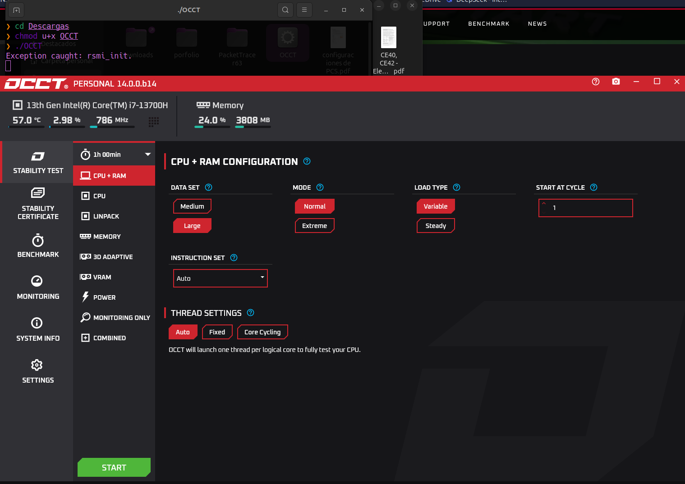

# Guía Completa para OCCT (OverClock Checking Tool)

## **Introducción**

OCCT es una herramienta esencial para pruebas de estabilidad, estrés y monitoreo de hardware. Ofrece diferentes pruebas específicas para componentes como CPU, GPU, memoria y fuente de alimentación, lo que la convierte en una solución todo-en-uno para entusiastas y técnicos.

---

## **Descarga e Instalación**

### **1. Descarga**

- Visita la página oficial de OCCT en [https://www.ocbase.com/download](https://www.ocbase.com/download).
- Descarga la versión adecuada según tu sistema operativo.

### **2. Instalación**

- Abre el archivo descargado y sigue las instrucciones:
  - Acepta los términos y condiciones.
  - Selecciona la ubicación de instalación.
  - Haz clic en "Instalar".
- Una vez instalado, abre el programa.

---

## **Tipos de Pruebas y Uso Básico**

### **1. Prueba de CPU**

- **Uso**: Diseñada para probar la estabilidad y el rendimiento de la CPU.
- **Cómo ejecutarla**:
  - Selecciona la pestaña `CPU`.
  - Escoge entre `Small Data Set` (estrés máximo) o `Large Data Set` (prueba general).
  - Configura la duración de la prueba y haz clic en `Start`.
- **Qué observar**:
  - Temperatura, uso y voltajes en tiempo real.
  - Interrupciones de la prueba pueden indicar problemas de estabilidad.

### **2. Prueba de GPU 3D**

- **Uso**: Evalúa el rendimiento y la estabilidad de la GPU.
- **Cómo ejecutarla**:
  - Ve a la pestaña `3D` y selecciona la carga gráfica deseada.
  - Configura la resolución y haz clic en `Start`.
- **Qué observar**:
  - Temperaturas y frecuencias de la GPU.
  - Artefactos visuales podrían indicar problemas con la tarjeta gráfica.

### **3. Prueba de Memoria RAM**

- **Uso**: Detecta problemas o errores en los módulos de memoria RAM.
- **Cómo ejecutarla**:
  - Ve a la pestaña `Memory`.
  - Establece el tamaño de la prueba (puedes probar toda la memoria disponible).
  - Haz clic en `Start` para iniciar la prueba.
- **Qué observar**:
  - Errores o fallos pueden señalar problemas en los módulos de RAM.

### **4. Prueba de Fuente de Alimentación (PSU)**

- **Uso**: Simula una carga máxima en el sistema para probar la estabilidad de la fuente de alimentación.
- **Cómo ejecutarla**:
  - Selecciona la pestaña `Power`.
  - Activa la prueba combinada que estresa tanto CPU como GPU.
  - Haz clic en `Start`.
- **Qué observar**:
  - Revisa si el sistema se apaga o reinicia, lo que podría indicar insuficiencia de potencia.

### **5. Prueba de GPU: Memoria VRAM**

- **Uso**: Evalúa el estado de la memoria de la tarjeta gráfica.
- **Cómo ejecutarla**:
  - Ve a la pestaña `GPU: Mem Test`.
  - Haz clic en `Start` para iniciar la prueba.
- **Qué observar**:
  - Errores en la memoria VRAM pueden indicar defectos o problemas de estabilidad.

---

## **Interpretación de Resultados Generales**

- Los gráficos ofrecen información en tiempo real sobre temperaturas, voltajes y frecuencias.
- **Puntos clave a evaluar**:
  - Temperaturas excesivas: podrían requerir soluciones de enfriamiento.
  - Inestabilidad o interrupciones: revisa configuraciones de overclocking o hardware defectuoso.
  - Errores en pruebas: podrían requerir la sustitución del componente afectado.